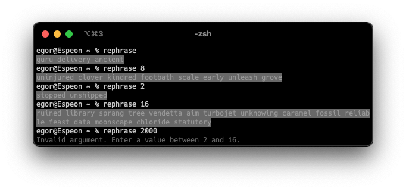

# Hardpass/Rephrase

Random password and passphrase generators created with [Ruby](https://www.ruby-lang.org/en/). For additional security, generated keys are rendered with a visibility mask. Simple.

## Hardpass

Generates a password from a random selection of characters from the following groups:

* `abcdefghijklmnopqrstuvwxyz`
* `ABCDEFGHIJKLMNOPQRSTUVWXYZ`
* `0123456789`
* <code>!"#$%&'()*+,-./:;<=>?@_[\\]^&grave;{|}~</code>

At least 1 character from each group is used.

### Usage

>`hardpass` - Generates an 8-character password.

>`hardpass 16` - Generates a 17-character password. Accepts values between `4` and `64`.

## Rephrase

Generates a passphrase from a random selection of _7776_ English words from the [Diceware](https://theworld.com/~reinhold/diceware.html) wordlist.

### Usage

>`rephrase` - Generates a 3-word passphrase.

>`rephrase 5` - Generates an 5-word passphrase. Accepts values between `2` and `16`.

